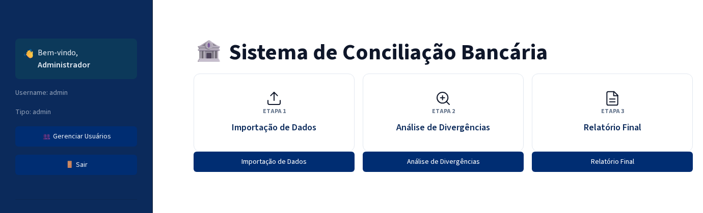

# Sistema de Conciliação Bancária

Aplicação web em [Streamlit](https://streamlit.io) para conciliar extratos bancários (OFX, CNAB, CSV, Excel, PDF com texto) com lançamentos contábeis: identifica correspondências automaticamente, aponta divergências e gera um relatório executivo em PDF para auditoria.



**App publicado:** https://concbanctest.streamlit.app/

## Funcionalidades

- **Importação multi-formato** — OFX, CNAB (.RET), CSV, Excel e PDF com texto, para extrato bancário e lançamentos contábeis.
- **Correspondência em 3 camadas** — exata (identificadores únicos) → heurística (tolerância de valor e data configurável) → avançada (similaridade textual e padrões temporais, como parcelas e mensalidades). As três camadas usam regras determinísticas, não um modelo de linguagem.
- **Análise de divergências** — indicadores de cobertura, itens em aberto, diferença líquida e correspondências por similaridade, com exportação em CSV.
- **Relatório executivo em PDF** — capa, síntese, ponte de reconciliação e recomendações, gerado com WeasyPrint a partir de um template HTML. Textos por regras determinísticas, sem IA generativa.
- **Autenticação e auditoria** — login com PBKDF2, limite de tentativas, sessão por JWT com revogação no logout, e trilha de auditoria das ações (upload, análise, geração de relatório).

## Como rodar localmente

Requer Python 3.10 ou mais recente (testado em 3.10, 3.12 e 3.13).

```bash
python -m venv venv
venv\Scripts\activate          # Windows
# source venv/bin/activate     # Linux/macOS

pip install -r requirements.txt
streamlit run app.py
```

O relatório em PDF usa [WeasyPrint](https://weasyprint.org/), que depende de bibliotecas do sistema (Pango, Cairo, HarfBuzz). No Linux/WSL, instale os pacotes listados em `packages.txt`:

```bash
sudo apt-get install -y $(cat packages.txt)
```

No Windows, siga o [guia de instalação do WeasyPrint](https://doc.courtbouillon.org/weasyprint/stable/first_steps.html#windows) ou rode a aplicação via WSL/Docker.

### Variáveis de ambiente

| Variável | Obrigatória | Efeito |
|---|---|---|
| `CONCILIACAO_SECRET_KEY` | Em produção | Chave usada para assinar as sessões (JWT). Sem ela, o app gera uma chave aleatória a cada processo — sessões caem a cada reinício e não funcionam com múltiplos processos. |
| `CONCILIACAO_LIMITE_OFX_TRANSACOES` | Não (padrão 20000) | Limite de transações por arquivo OFX importado. |
| `CONCILIACAO_LIMITE_CSV_LINHAS` / `..._COLUNAS` / `..._CAMPO_CARACTERES` | Não | Limites estruturais do CSV importado (padrão 100000 linhas, 200 colunas, 10000 caracteres por campo). |

### Login de teste

Em banco de dados vazio, o app cria automaticamente o usuário `admin` / `admin123`. É uma credencial de bootstrap para ambiente de teste — **troque-a (ou desative o bootstrap) antes de qualquer uso com dados reais.**

## Testes

```bash
pip install -r requirements-dev.txt
pytest
```

O catálogo funcional de casos de teste, executados manualmente ou via E2E, fica em [`docs/casos-de-teste.md`](docs/casos-de-teste.md) (também em PDF).

## Estrutura do projeto

```
app.py                   # login, sessão e página inicial
pages/                    importação, análise, relatório final
modules/                  regras de negócio: matching, relatório, auditoria, autenticação
templates/                template HTML do relatório executivo (WeasyPrint)
assets/                   fontes e CSS do tema
tests/                    suíte de testes automatizados (pytest)
docs/                     documentação técnica e catálogo de casos de teste
```

## Dados de exemplo

A pasta `Exemplos/` traz extratos e lançamentos sintéticos para testar o fluxo completo sem dados reais.
